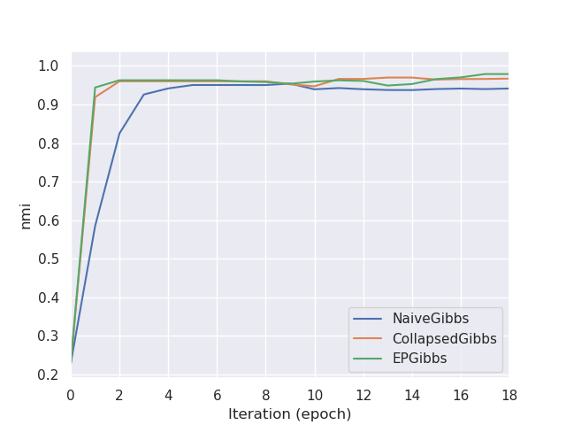
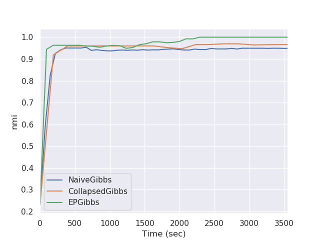
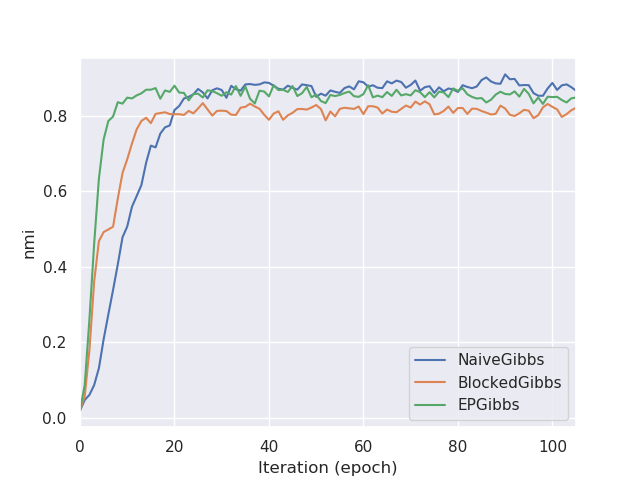
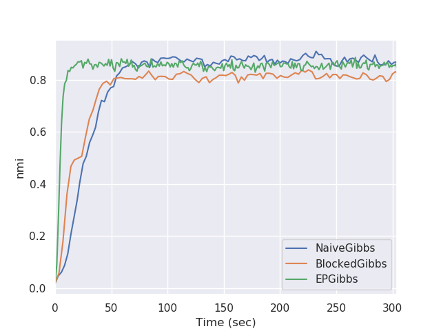

# Approximate Collapsed Gibbs Sampling with Expectation Propagation
> This is Python 3 code for clustering latent variable models with approximate Gibbs sampling.

This repo contains example python code for the paper [Approximate Collapsed Gibbs Clustering with Expectation Propagation](https://arxiv.org/abs/1807.07621) and [Scalable Clustering of Correlated Time Series using Expectation Propagation](https://aicherc.github.io/pdf/aicherc2016scalable.pdf)

## Overview
* The `experiments` folder stores example python scripts for both correlated time series clustering and robust mixture modeling.
* The `output` folder stores output for the example python scripts.
* The `ep_clustering` folder stores the python module code for the various Gibbs sampling methods for a variety of models. See `ep_clustering/README.md` for additional details

## Installation
Install add the `ep_clustering/` folder to the python path.

Requirements:
`python 3+`, `matplotlib`, `ipython`, `joblib`, `numpy`, `scipy`, `pandas`, `scikit-learn`, `tqdm`, `seaborn`

## Usage Example
For *correlated time series clustering*:
* Walk through `experiments/synthetic_timeseries_clustering_example.py` for an overview of the API
* Run `experiments/synthetic_timeseries_compare_example.py` to compare naive, collapsed, and approx-EP Gibbs. (This script takes a while).
Below is example output comparing normalized mutual information (NMI) of each sampler's inferred clustering compared to the truth

NMI vs Iteration | NMI vs Time
:---------------:|:------------:
  |  

For *robust mixture modeling* with the Student's-$t$ distribution:
* Walk through `experiments/synthetic_mixture_clustering_example.py` for an overview of the API
* Run `experiments/synthetic_mixture_compare_example.py` to compare naive, blocked, and approx-EP Gibbs.

NMI vs Iteration | NMI vs Time
:---------------:|:------------:
  |  

## Release History / Changelog

* 0.1.0
    * The first release (Dec 2019)
    * Over-engineered code from the beginning of my PhD

## Meta

Christopher Aicher - aicherc@uw.edu

Distributed under the MIT license. See ``LICENSE`` for more information.

